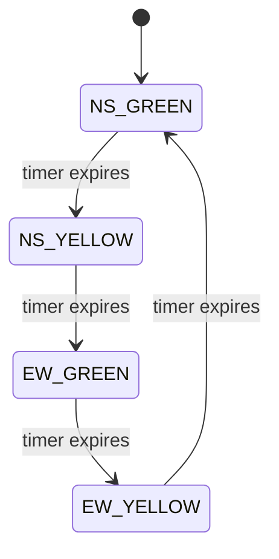
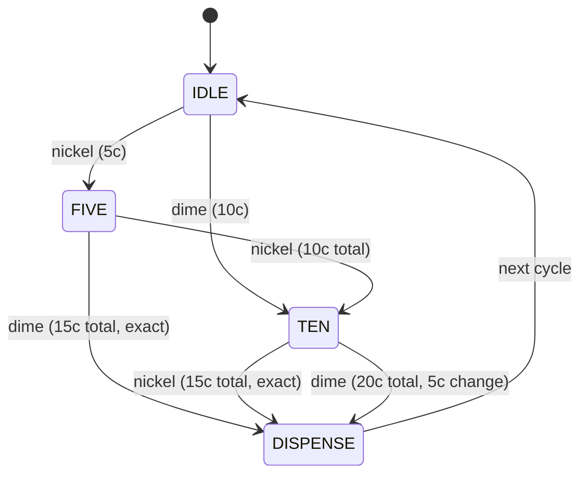

# 🔀 Verilog FSM Projects: Traffic Light Controller & Vending Machine

Two classic digital-design FSM (Finite State Machine) projects implemented
in Verilog HDL, each with a self-checking testbench. Good for a Digital
Electronics / VLSI course project or a GitHub portfolio piece showing
RTL design fundamentals.

Both designs were **simulated and verified with Icarus Verilog** — the
waveforms and console output confirm correct behavior (see screenshots
section below; add your own after running).

## 📁 Project Structure
```
verilog-fsm-projects/
├── README.md
├── traffic_light_controller/
│   ├── traffic_light_fsm.v     # DUT (Design Under Test)
│   └── traffic_light_tb.v      # Testbench
└── vending_machine/
    ├── vending_machine_fsm.v   # DUT
    └── vending_machine_tb.v    # Testbench
```

---

## 1️⃣ Traffic Light Controller

A Moore FSM controlling a 2-road intersection (North-South vs East-West),
cycling through green → yellow → red with configurable timing.

### State Diagram


### Truth Table (Moore outputs — depend only on current state)
| State     | NS Light | EW Light |
|-----------|----------|----------|
| NS_GREEN  | GREEN    | RED      |
| NS_YELLOW | YELLOW   | RED      |
| EW_GREEN  | RED      | GREEN    |
| EW_YELLOW | RED      | YELLOW   |

### Design Notes
- Durations (`NS_GREEN_TIME`, `EW_GREEN_TIME`, `YELLOW_TIME`) and the
  clock-divider (`CLK_FREQ`, cycles per simulated "second") are Verilog
  **parameters**, so you can retarget this for a real FPGA (e.g.
  `CLK_FREQ = 50_000_000` for a 50 MHz board clock) without touching the
  RTL — just override the parameters at instantiation.
- Lights are 3-bit one-hot: `RED=100`, `YELLOW=010`, `GREEN=001` — easy to
  map directly to 3 physical LEDs per road on a dev board.

### Simulated Output (Icarus Verilog)
```
time    state   NS_light    EW_light
  12    0        GREEN         RED
 215    1       YELLOW         RED
 295    2          RED       GREEN
 455    3          RED      YELLOW
 535    0        GREEN         RED
 735    1       YELLOW         RED
```
Confirms the correct round-robin sequence with exactly one road red while
the other cycles through green/yellow.

---

## 2️⃣ Vending Machine Controller

A 4-state Moore FSM modeling a vending machine that accepts **nickel (5¢)**
and **dime (10¢)** coin pulses for an item priced at **15¢**, dispensing
the item once the total reaches/exceeds 15¢, and returning 5¢ change if
overpaid (10¢ + 10¢ = 20¢).

### State Diagram


### Truth Table
| Current State | Input  | Next State | dispense | change5 |
|----------------|--------|------------|----------|---------|
| IDLE           | nickel | FIVE       | 0        | 0       |
| IDLE           | dime   | TEN        | 0        | 0       |
| FIVE           | nickel | TEN        | 0        | 0       |
| FIVE           | dime   | DISPENSE   | 1        | 0       |
| TEN            | nickel | DISPENSE   | 1        | 0       |
| TEN            | dime   | DISPENSE   | 1        | 1       |
| DISPENSE       | —      | IDLE       | 0        | 0       |

### Simulated Output (Icarus Verilog) — all 5 test cases passed
```
-- Test 1: nickel then dime (5+10=15) --   dispense=1  change5=0  ✅
-- Test 2: dime then nickel (10+5=15) --   dispense=1  change5=0  ✅
-- Test 3: dime then dime  (10+10=20) --   dispense=1  change5=1  ✅
-- Test 4: nickel x3       (5+5+5=15) --   dispense=1  change5=0  ✅
-- Test 5: reset mid-transaction      --   state returns to IDLE ✅
```

---

## 🛠️ How to Simulate

### Option A: Icarus Verilog (free, cross-platform, used to verify this repo)
```bash
# Install (Ubuntu/Debian)
sudo apt install iverilog gtkwave

# Traffic light controller
cd traffic_light_controller
iverilog -o tlc_sim traffic_light_fsm.v traffic_light_tb.v
vvp tlc_sim
gtkwave traffic_light.vcd      # view waveform

# Vending machine
cd ../vending_machine
iverilog -o vm_sim vending_machine_fsm.v vending_machine_tb.v
vvp vm_sim
gtkwave vending_machine.vcd    # view waveform
```

### Option B: Xilinx Vivado / Intel Quartus / ModelSim
1. Create a new project, add the `.v` files (DUT + testbench).
2. Set the testbench as the simulation top module.
3. Run Behavioral Simulation.
4. View the waveform viewer built into the tool.

### Option C: EDA Playground (browser, no install)
Paste the DUT into the left pane and the testbench into the right pane
at [edaplayground.com](https://edaplayground.com/), select Icarus Verilog
as the simulator, and run — good for quickly sharing/demoing the project.

---

## 🎯 For Your Resume / Report
- Mention **FSM type (Moore)**, **states**, and **verification method**
  (self-checking testbench, waveform-verified with Icarus Verilog/GTKWave).
- Add a screenshot of the GTKWave waveform to your README/report — it's
  the most convincing proof of correct RTL behavior for a reviewer.
- If targeting an FPGA board, add a `constraints.xdc` (Xilinx) or `.qsf`
  (Intel) pin-mapping file and mention the board you targeted.

## 🚀 Future Improvements
- **Traffic light**: add pedestrian crossing button/state, night-mode
  (blinking yellow), left-turn arrow phase, or sensor-based (vehicle
  present) timing instead of fixed timers.
- **Vending machine**: support more coin types (quarter), multiple item
  prices/selection buttons, an "insufficient funds" refund state, and a
  low-stock/out-of-order state.
- Add **SystemVerilog assertions (SVA)** or a constrained-random
  testbench for more rigorous verification.
- Synthesize on a real FPGA (e.g. Basys3/DE10-Lite) and drive actual LEDs.

---
**Author:** Your Name
**Tools used:** Verilog HDL, Icarus Verilog, GTKWave
